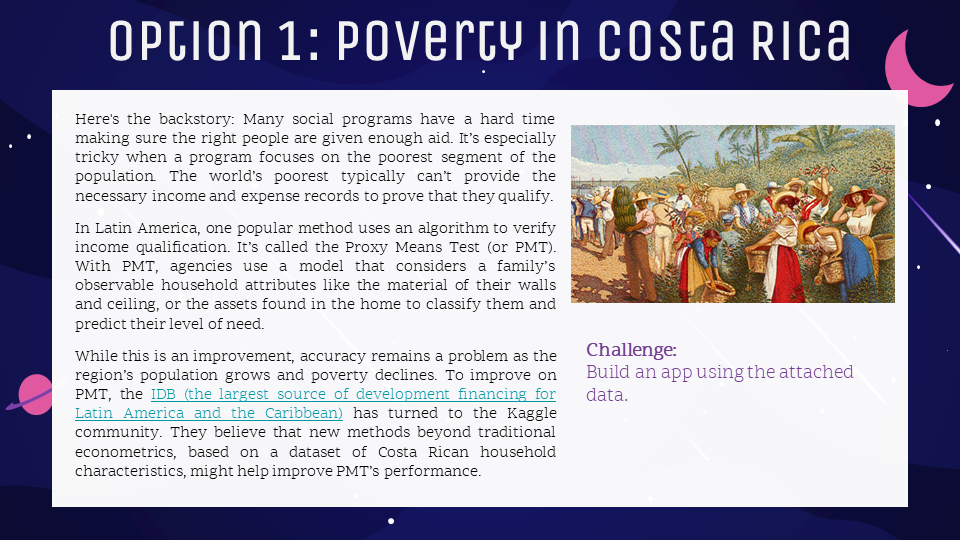
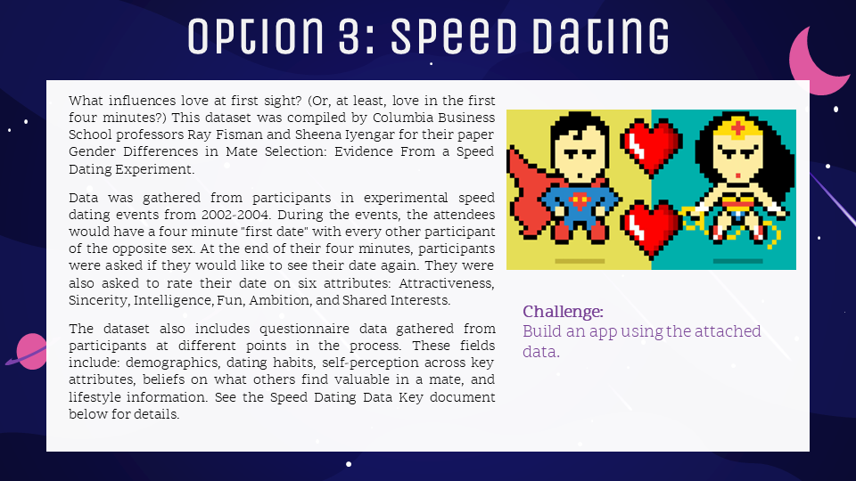

<style>
@import url('https://fonts.googleapis.com/css?family=Scope+One&display=swap');
@import url('https://fonts.googleapis.com/css?family=Scope+One|Unica+One&display=swap&subset=latin-ext');
@import url('https://fonts.googleapis.com/css?family=Open+Sans&display=swap');

h1,h2 {font-family: 'Unica One', cursive;
      font-size: 85px;}
p {font-family: 'Open Sans', sans-serif;
      font-size: 13px;}      
</style>

```{r setup, include=FALSE}
knitr::opts_chunk$set(echo = TRUE)
```
# Pre-Requisites

**Hello 4Mosters! Welcome to R Shiny Training with Gissella & Nir!**

Before we start training on Friday, please ensure the following 
libraries, commands and data are loaded, functioning and ready to run!
Please ensure you can load all data if you're unsure about which dataset you would like to use. 

## Contents {#home}
  - [Libraries](#libraries)
  - [Directories](#directories) 
  - [Datasets](#datasets)
  - [R Commands](#rcomm)
  - [R Cheatsheets ](#rcheat)

## Libraries (Required) {#libraries} 

Not all these packages/libraries will be used today but having them ready makes life easier. It is quicker to make sure that these are there and working than calling Miles over.


```{r eval=FALSE, include=TRUE}
install.packages("shiny")
library(shiny)
install.packages("shinyWidgets") #Upgraded version of widgets
library(shinyWidgets) #To view widget options run the following: shinyWidgetsGallery()
install.packages("DT") #Allows you to view and sort through your data in your app
library(DT)
install.packages("tidyverse")
library(tidyverse)
install.packages("dplyr") #allows for fast data manipulation
library(dplyr)
install.packages("DataExplorer") #Creates an amazing EDA report easily and quickly
library(DataExplorer)
install.packages("ggplot2") #widely used package for plotting
library (ggplot2)
install.packages("plotly") #Will you to wrap ggplots in Plotly
library(plotly)
install.packages("googleVis") #Google's visual package for R - similar to Plotly
library(googleVis)
install.packages("ShinyDashboard") #Allows you to create a dashboard layout easily
library(ShinyDashboard)
install.packages("leaflet") #maps! useful if you would like to viz using a map
library(leaflet)
install.packages("r2d3") #allows you to use d3.js (advanced viz) in R
library(r2d3)
```

[Home](#home)

## Working Directory (Required) {#directories}

You will be creating a folder structure here, so make sure this is a clean space.

```{r eval=FALSE, include=TRUE}
#Find where your current working directory is located
getwd()
#Set path of New working directory -> "C:/MyDocExample/Training"
setwd("<new path>")
```

[Home](#home)


## Datasets (Required) {#datasets}

You will be working with a partner on one of the following datasets. Please read the dataset descriptions and ensure you have uploaded the datasets beforehand. **We will not have enough time for IT issues related to data uploads.**

### Dataset 1: Predicting Poverty in Costa Rica

Ensure the following datasets load from your working directory. Code that can be used to upload data:
```{r eval=FALSE, include=TRUE}
CRPov = read.csv("Costa_train")
CRPov2 = read.csv("Costa_test") #Optional - test data if you build a model
```

Click on image to download dataset from T&D dashboard

<center>
<div style="width:90%; height:80%">
[](https://4mosteurope.sharepoint.com/:f:/r/sites/traininganddevelopment/RTraining/Option%201_Poverty%20in%20Costa%20Rica?csf=1&e=BLAUG7)
</div>
</center>

### Dataset 2: AirBnB & Berlin

Ensure the following datasets load from your working directory. Code that can be used to upload Airbnb data:
```{r eval=FALSE, include=TRUE}
AirBer = read.csv("listings_summary") 
#'listings_summary' - This is the main dataset to use.
#There are optional datasets in the folder which contain additional useful information.
#However, if you don't have much time the dataset above contains most useful info.
```

Click on image to download dataset from T&D dashboard

<center>
<div style="width:90%;height:80%">
[](https://4mosteurope.sharepoint.com/:f:/r/sites/traininganddevelopment/RTraining/Option%202_AirBnB%20and%20Berlin?csf=1&e=5yZ7EY)
</div>
</center>

### Dataset 3: Speed-dating

Click on image to download dataset from T&D dashboard

<center>
<div style="width:90%; height:80%">
[](https://4mosteurope.sharepoint.com/:f:/r/sites/traininganddevelopment/RTraining/Option%203_Speed%20Dating?csf=1&e=vba1TM)
</div>
</center>

[Home](#home)


## R Commands {#rcomm}

To save you some time, check out some useful commands below:
```{r eval=FALSE, include=TRUE}
#View first x number of rows of your data
head(mydata, 5)

#View the type and preview of all columns
glimpse(mydata)

#Quick EDA of your data!
summary(mydata)  
DataExplorer:::create_report(mydata)

#How to get the unique values of a variable (i.e., like a Proc Freq).
#Useful for knowing what options to input in your widgets!
options = unique(mydata.variable) 
```

[Home](#home)

## R Cheatsheets {#rcheat}

Below you can also find usefule R cheatsheets. Click on pictures for downloads
R Shiny.

- Base R
- R Shiny
- ggPlot2
- Plotly for R
- Time-Series in R
- Machine Learning in R

**Base R Cheatsheet:**   

<center>
<div style="width:75%; height:65%">
[](https://4mosteurope.sharepoint.com/:b:/r/sites/traininganddevelopment/RTraining/base-r.pdf?csf=1&e=X3kuim)
</div>
</center>

**R Shiny Cheatsheet:** 

<center>
<div style="width:75%; height:65%">
[](https://4mosteurope.sharepoint.com/:b:/r/sites/traininganddevelopment/RTraining/Shiny%20Cheatsheet.pdf?csf=1&e=kGVSaP)
</div>
</center>

**ggPlot2 Cheatsheet:** 

<center>
<div style="width:75%; height:65%">
[](https://4mosteurope.sharepoint.com/:b:/r/sites/traininganddevelopment/RTraining/ggplot2-cheatsheet.pdf?csf=1&e=4o84mk)
</div>
</center>

**Plotly/R Cheatsheet:** 

<center>
<div style="width:75%; height:65%">
[](https://4mosteurope.sharepoint.com/:b:/r/sites/traininganddevelopment/RTraining/r_cheat_sheet.pdf?csf=1&e=qjqww7)
</div>
</center>

**Time-Series Cheatsheet:** 

<center>
<div style="width:75%; height:65%">
[](https://4mosteurope.sharepoint.com/:b:/r/sites/traininganddevelopment/RTraining/time-series.pdf?csf=1&e=ST362h)
</div>
</center>

**Machine Learning in R Cheatsheet:** 

<center>
<div style="width:75%; height:65%">
[](https://4mosteurope.sharepoint.com/:b:/r/sites/traininganddevelopment/RTraining/Machine%20Learning%20Modelling%20in%20R.pdf?csf=1&e=Vss7h5)
</div>
</center>

[Home](#home)


